# OPMRUN
OPMRUN is graphical user interface to Flow that has similar functionality to the commercial simulator’s ECLRUN program. 
Target audience are Reservoir Engineers in a production environment. Developers and experienced Linux users will already 
have compatible work flows.

  * Allows editing and management of OPM Flow’s run time parameters. Default parameters are automatically loaded from 
OPM Flow, and the user can reset the default set either from a parameter or PRT file. Editing of a job’s parameter file 
is also available.

  * Allows simulation jobs to be queued and run in either foreground (under OPMRUN), or background (in an xterm terminal 
session). Jobs in the queue can be set to run in NOSIM mode or RUN mode.

  * Foreground jobs can be killed from OPMRUN.

  * Queues can be edited, saved and loaded.

  * Jobs can be compressed to save space (DATA , and all OPM Flow output files) and uncompressed.

OPMRUN now includes a keyword generator (OPMKEYW) based on the Apache Velocity Template Language (“VTL”). The templates 
can therefore also be used with any editor that supports VTL, jEdit for example. There is one template per keyword, with 
formatting the same as the OPM Flow manual. Over 450 templates are currently implemented.

One can also customize the existing templates as well as creating User defined templates by including the templates in 
the template directory and following the VTL language syntax. Keywords filtered by Section in alphabetic order, and can 
also list all the keywords. Multiple keywords can be generated at a time and copied to the clipboard or saved to a file.
Section keywords (RUNSPEC, GRID, EDIT, PROPS, SOLUTION, SUMMARY and SCHEDULE) can optionally generate a set of keywords 
for the section. 

The keywords are examples, one still has to edit the resulting deck with the actual required data, but the format with 
comments should make this a straight forward process.

OPMRUN is written in Python 3 and tested under Unbuntu-Mate 18.04 TLS. Compiled binary version should work on all Linux 
systems, no need to install dependencies or Python.

## Notes:
Only Python 3 is currently supported and tested Python2 support has been depreciated. The following standard module 
libraries are used in this version.

1. datetime
2. getpass
3. os
4. pathlib 
5. psutil
6. sys
7. re
8. subprocess

In addition the following Python modules are required for OPMRUN:

1. PySimpleGUI

For OPMKEYW, the integrated OPM Flow Keyword Generator, the following standard modules are required:

1. datetime
2. platform
3. pathlib
4. tkinter as tk

In addition the OPMKEYW requires the following additional modules:

1. PySimpleGUI
2. airspeed

# OPMRUN Functionality

## Simple and Clean Interface.

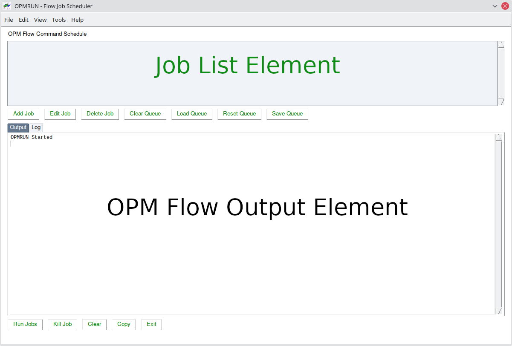

## Add Job and Select Run Type

## Edit Job Data and Parameter File.

## Job Load Previously Saved Queue.

## Reset Job Queue Parameters
Allows jobs run under Windows 10 WSL to be renamed for running under Linux, and changing jobs from serial to parallel and vice versa.

## Run Jobs in Queue with Various Options.
Notice the option to switch from NOSIM mode to RUN mode for all jobs in the queue.

Running a Job in the Queue Creates a Log File which is a copy of the terminal output.

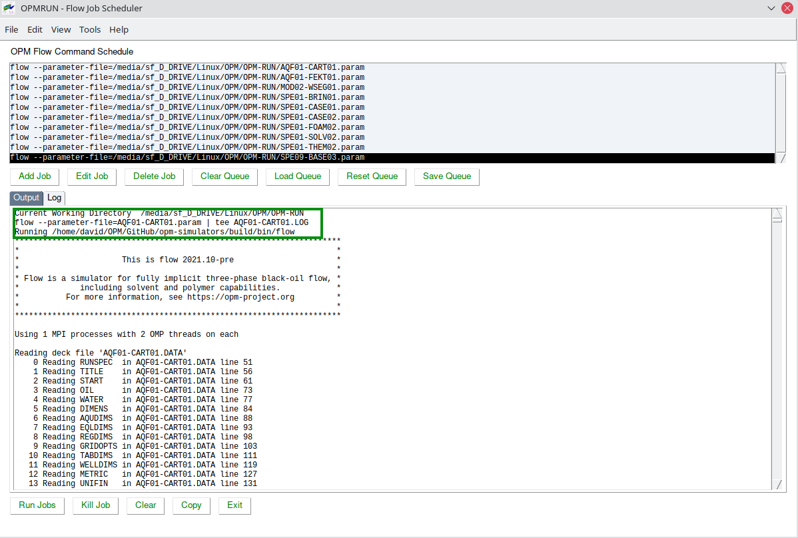

as well as creating a Schedule Log for tracking progress.

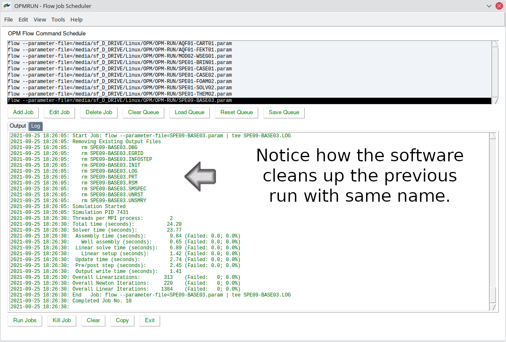

Can also **Kill** the current running job. If a job is killed then their is an additional option to kill all jobs in queue.

The **Clear** button the output from the currently selected tab (Output or Log), and the **Copy** button will copy the output from the currently selected tab to the clipboard.

## File Menu Options
Enables open and saving the job queue, switching projects and listing OPMRUN's user properties.

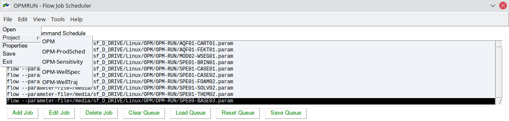

## Edit Menu Options

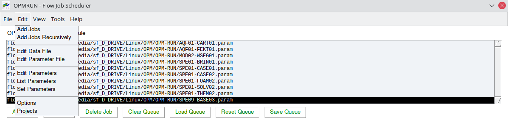

Lets one add jobs, add jobs recursively (all jobs in the selected directory and below), edit the data file:

Edit, list and set default OPM Flow job parameters

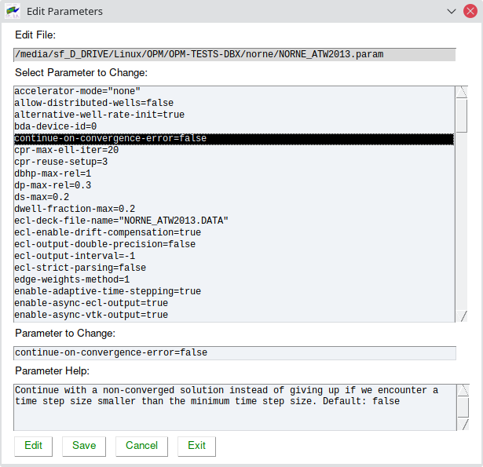

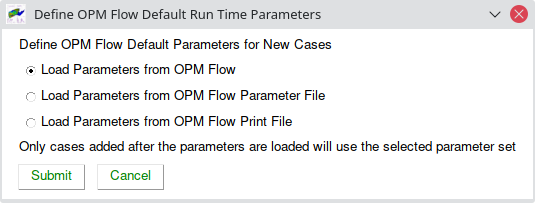

Set OPMRUN Options including:
  * OPM Flow manual location.
  * OPMKEYW  “template directory”.
  * ResInsight location.
  * Setting the editor command.
  * Terminal console for running jobs in background. If running jobs under the Windows Subsystem fo Linux then this should be set to **wsl**.
  * Author property fields used in some templates in OPMKEYW.
  * Defining OPMRUN output panel’s size, font and font size.
  
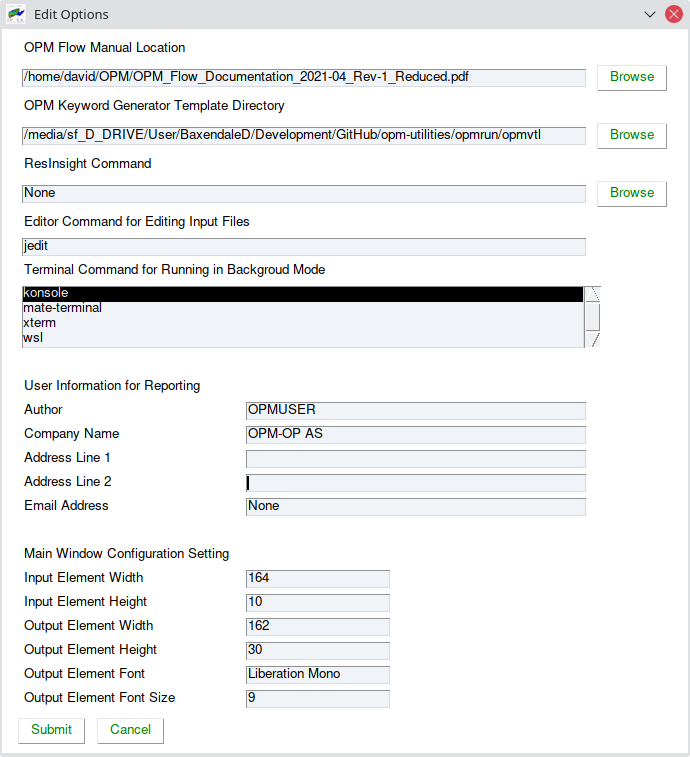

Define Projects for switching between different projects/directories. Stored in user’s home directory in sub-directory OPM. Options includes:

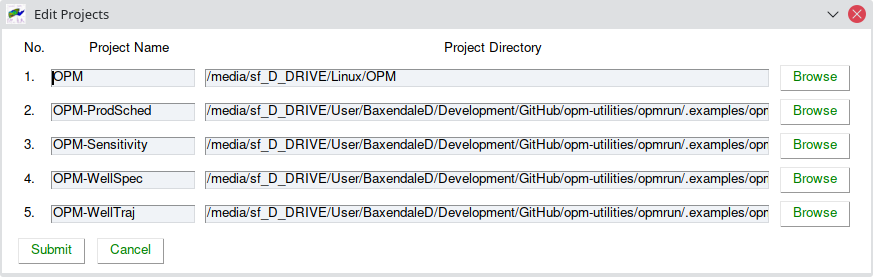

## View Menu Options.
Allows the user to view the results od an OPM Flow simulation run using the default editor.

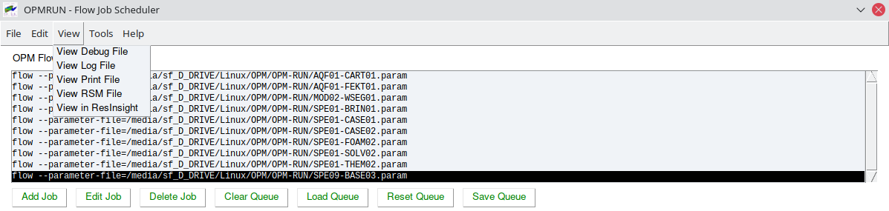

## Tools Menu Options
Contains various tool that may be useful in building a simulation model.

See the individual sections below for further details on the available tools.

## Help Menu Options
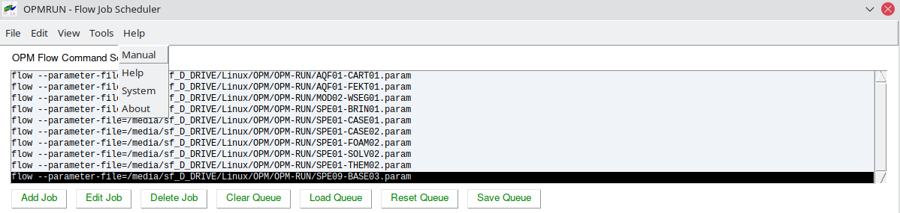

Use the Edit / Options menu option to select the ;ocation of the OPM Flow Manual.

# OPMRUN TOOLS (STILL TO UPDATE)

## Job File Compression and Uncompression for Saving Space and Archiving.

# OPMRUN Keyword Generator: OPMKEYW

## OPMKEYW - OPM Flow Keyword Generator
The Keyword Generator is located under the “Tools” menu “Deck Generator” option. Additional Deck Generator applications 
are planned for future versions.

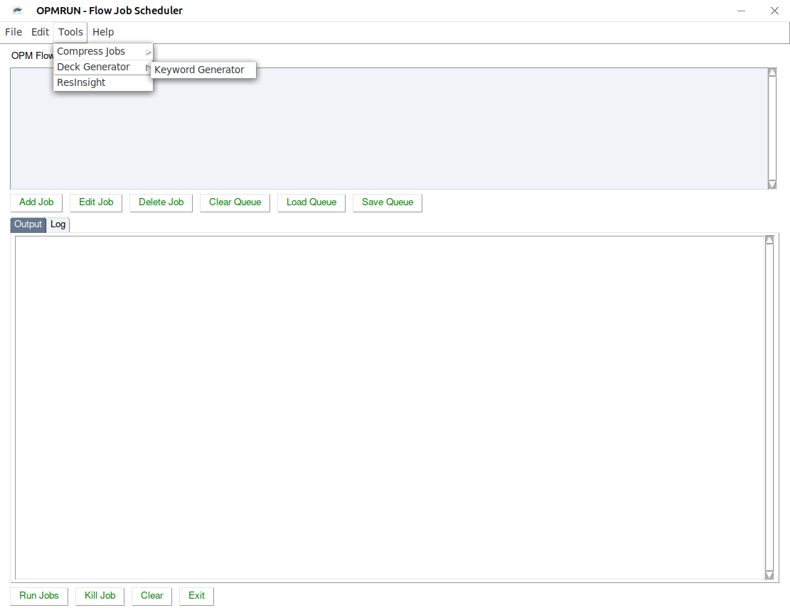

## OPMKEYW: Keyword Generator 
The main elements are the KEYWORD LIST, KEYWORD FILTER OPTIONS and the DECK ELEMENT, as shown below

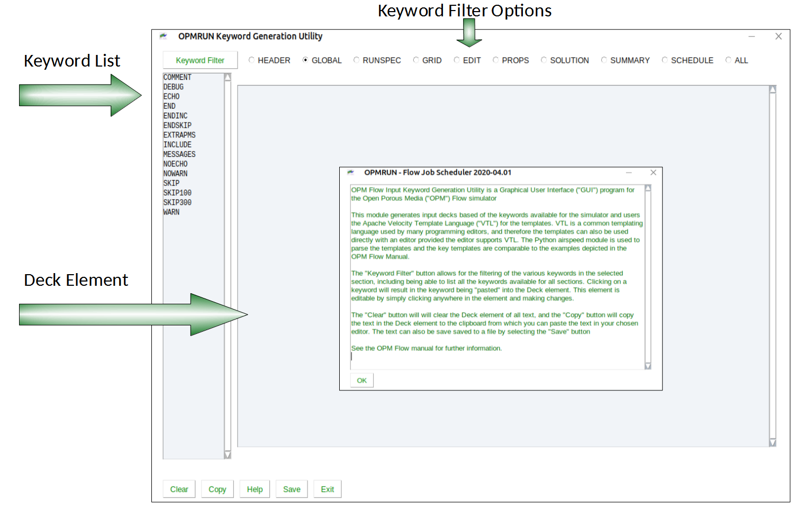

## OPMKEYW: Filter and Headers
The "Keyword Filter" button allows for the filtering of the various keywords in the selected section, including being 
able to list all the keywords available for all sections.  The HEADER section allows for a start and end of file 
comment headers. Clicking on a keyword will result in the keyword being "pasted" into the Deck Element.

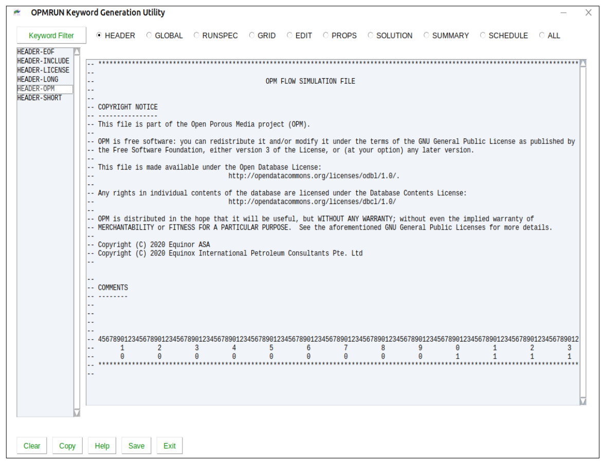

## OPMKEYW: Editable
The Deck Element is editable by simply clicking anywhere in the element and making changes. Use the “Clear” button to 
clear the Deck Element display.

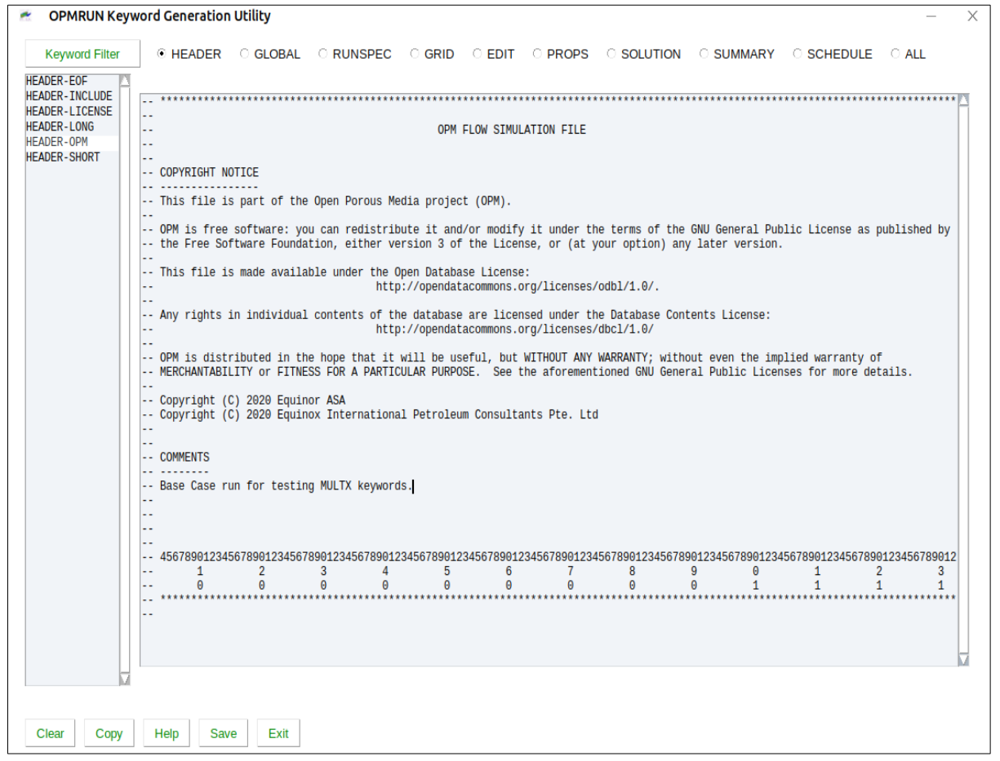

## OPMKEYW: File Imports
If a keyword requires a file, for example, the INCLUDE and LOAD keywords, then a dialog box is presented to enable the 
file to be selected. The application will also allow one to select the file name format, after the file has been 
selected.

Note that The COMMENT keyword, is not an actual keyword, but a comment block to make the deck more readable.

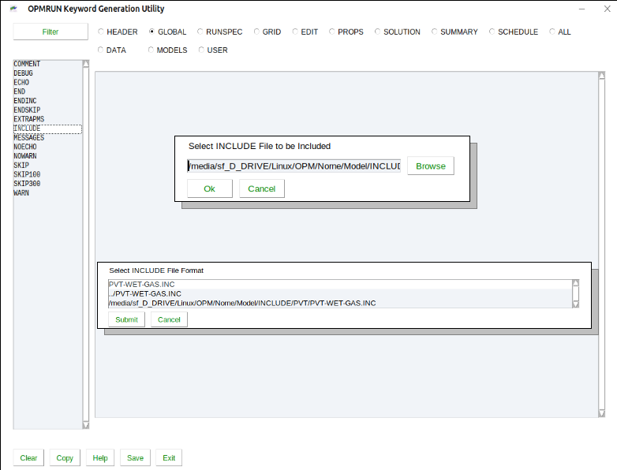

## OPMKEYW: Section Standard Set of Keywords
Selecting a Section keyword (RUNSPEC, GRID,  EDIT, PROPS, SOLUTION, SUMMARY, and SCHEDULE) will give an option to 
generate a representative set of keywords for that section. One can therefore generate a complete input deck in a 
matter of minutes.

However, you still have to edit this with your actual data.

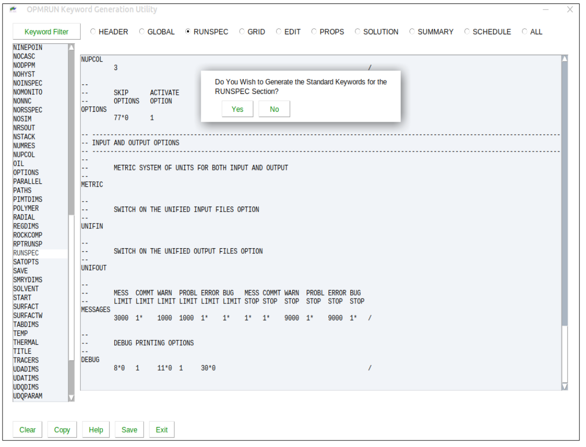

## OPMKEYW: SUMMARY Section Variables

For the SUMMARY section keyword, one can also generate various sets of summary variables based on the options being 
used in the model. Note that not all of the variables are currently available in OPM Flow, but are expected to be added 
in future versions.

OPM Flow will ignored those variables not implemented.

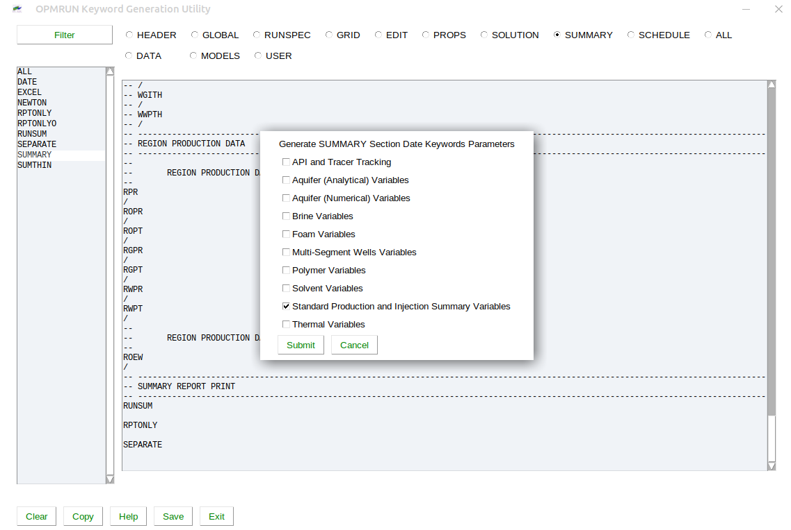

## OPMKEYW: SCHEDULE Section Keywords and Date Schedule
For The SCHEDULE Section keyword, one can also generate a date schedule from  a start year to and end year, using 
Annual, Quarterly, or Monthly time steps. A standard report is written at the beginning of each year and is 
subsequently switch off for intermediate  Quarterly and Monthly time steps. A final report is written at the end end of 
the run.

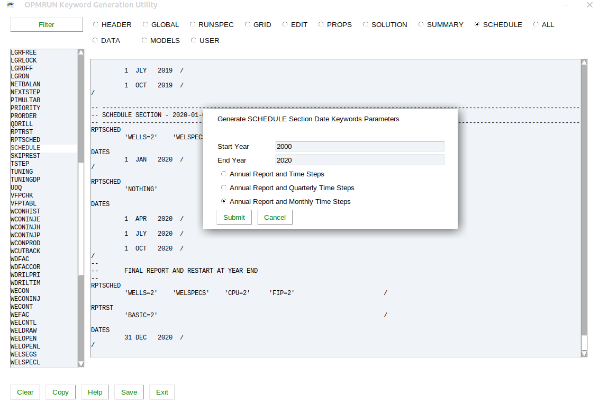

## OPMKEYW: DATA (Sets) Option
There is also a DATA option which is not an OPM Flow section, but a series of data sets. This 
is a collection of data sets that can be used as complete examples for a given data set, PVT for a Wet Gas 
Reservoir for example, or to build models for testing.

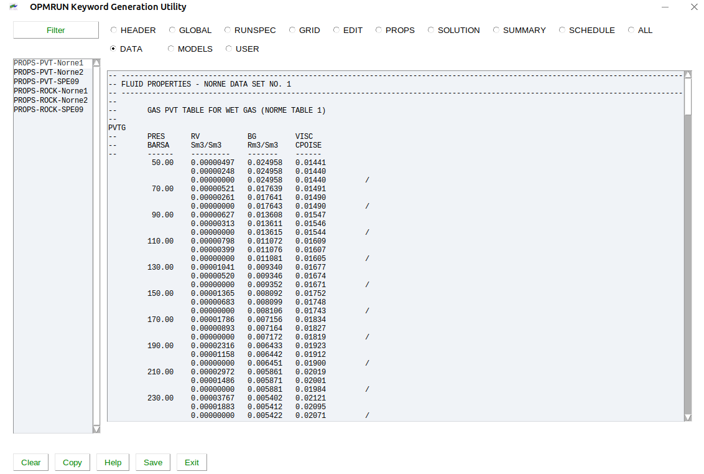

## OPMKEYW: MODEL Option

Again, the MODEL option is not an OPM Flow section, but contains complete models that show how various options are 
implemented in OPM Flow. 

Finally the USER option is where user can store their own templates. USER templates with the “vm” extension will 
automatically be listed by the Filter option.

## OPMKEYW: Copy & Save
Use the “Copy” button to copy the data in the Deck Element to the clipboard, which can then be pasted into your 
favorite editor.

Alternatively, one can save the data directly to a *.DATA or *.INC file for further editing and processing.

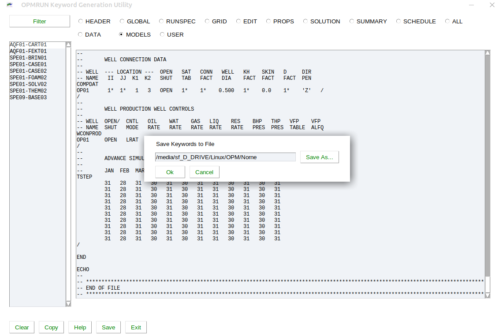

## OPMKEYW: USER Templates
After selecting a keyword, right clicking on the keyword allows one to load the actual template for the keyword.
One can then edit the template and save the changes back to the same template or another template.

Save USER templates in the USER directory with the extension ‘.vm’ to enable it to be used by the OPMKEYW via the USER 
option.

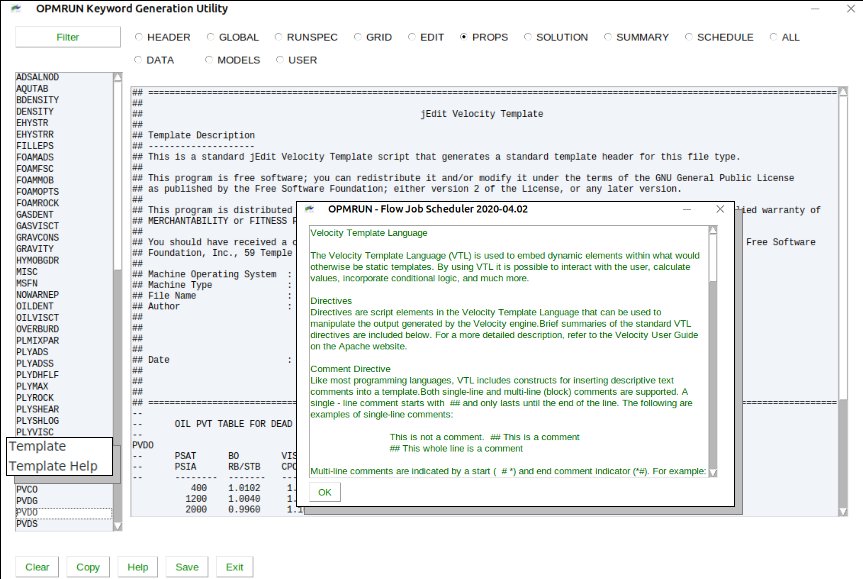

The Template Help option displays a brief introduction to VTL.

## OPMRUN Tools: Production Schedule

## OPMRUN Tools: Sensitivities

## OPMRUN TOOLS: Well Specification

## OPMRUN TOOLS: ResInSight

## OPMRUN TOOLS: Well Trajectory Conversion

