# OPMRUN
OPMRUN is graphical user interface to Flow that has similar functionality to the commercial simulator’s ECLRUN program. Target audience are Reservoir Engineers in a production environment. Developers and experienced Linux users will already have compatible work flows.

Allows editing and management of OPM Flow’s run time parameters. Default parameters are automatically loaded from OPM Flow, and the user can reset the default set either from a parameter or PRT file. Editing of a job’s parameter file is also available.

Allows simulation jobs to be queued and run in either foreground (under OPMRUN), or background (in an xterm terminal session). Jobs in the queue can be set to run in NOSIM mode or RUN mode.
Foreground jobs can be killed from OPMRUN.

Queues can be edited, saved and loaded.

Jobs can be compressed to save space (DATA , and all OPM Flow output files) and uncompressed.
Written in Python 3 and tested under Unbuntu-Mate 18.04 TLS.

Compiled binary version should work on all Linux systems, no need to install dependencies or Python.

## Notes:
Only Python 3 is currently supported and tested. Although attempts have been made for OPMRUN to run under
Python 2. The following standard module libraries are used in this version.

( 1) datetime
( 2) getpass
( 3) os
( 4) sys
( 5) re
( 8) subprocess

In addition the following Python modules are required:

( 1) PySimpleGUI
( 2) psutil
( 3) pathlib for Python 3 or pathlib2 for Python 2

PySimpleGUI is the GUI tool used to build OPMRUN. It is in active development and is frequently updated
for fixes and new features. This version of OPMRUN used verion 3.36.0 of PySimpleGUI, later and older
versions of PySimpleGUI may not work. Each release of OPMRUN will update to the latest release of
PySimpleGUI.

# Functionality

## Simple and Clean Interface.

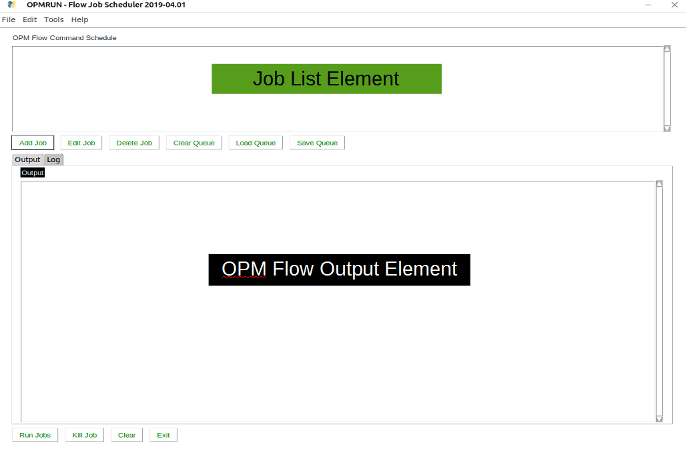

## Job Queue.

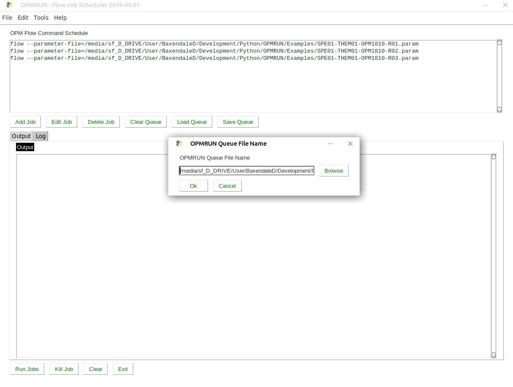

## Set Parameter Default Options.

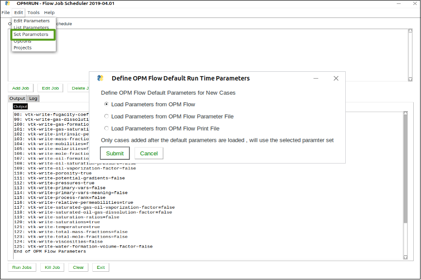

## Edit Job Data and Parameter File.

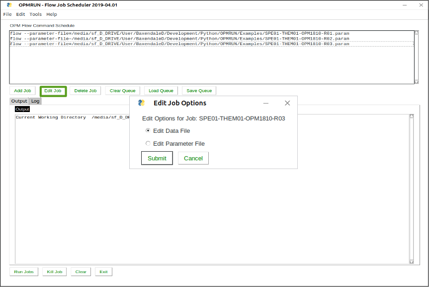

## Edit Parameter File with Help.
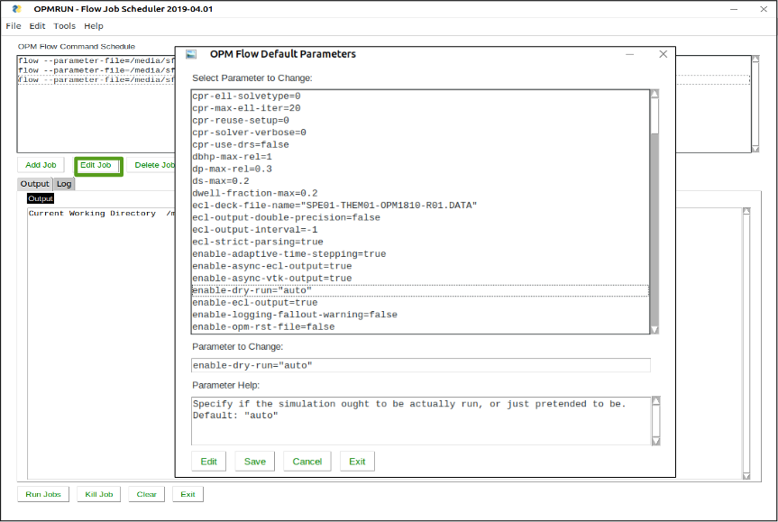

## Edit Data File with Preferred Editor.

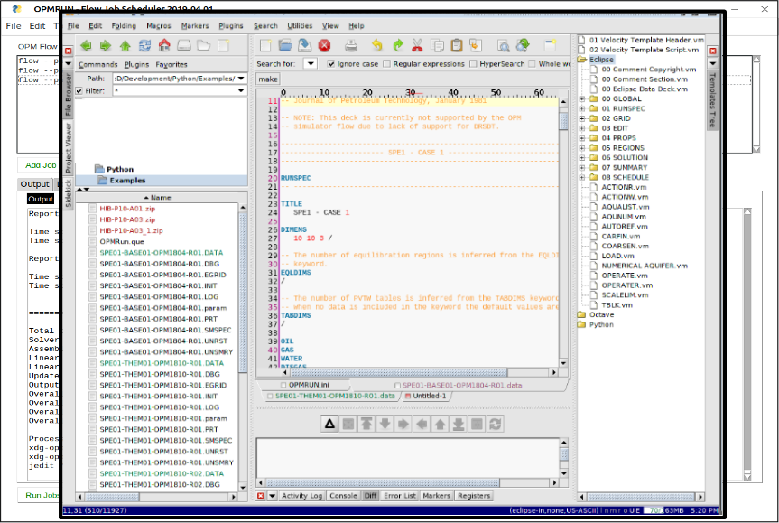

## Run Jobs in Queue with Various Options.

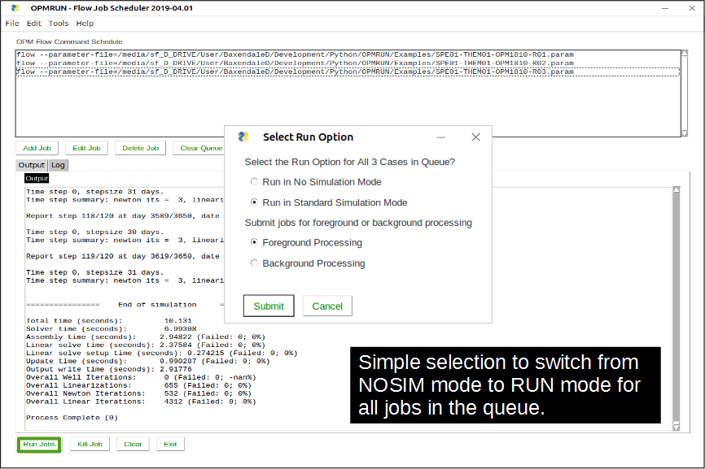

## Run Jobs in Queue Creates Log File.

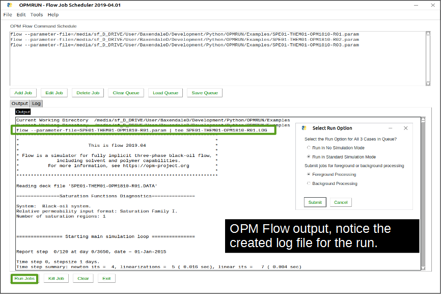

## Schedule Log for Tracking Progress.

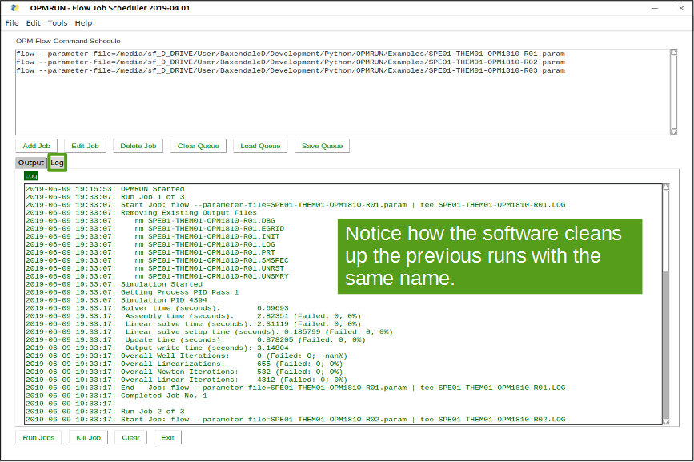

## Manual Available.

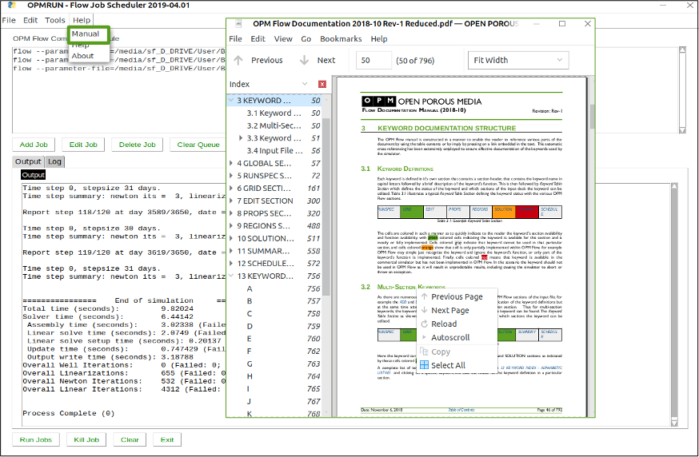

## Job File Compression and Uncompression for Saving Space and Archiving.

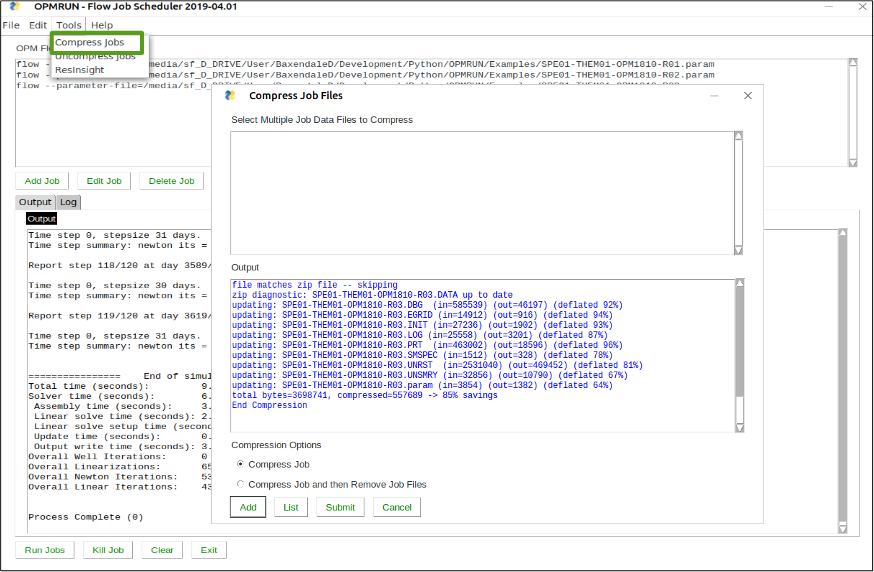

## OPMRUN.INI Settings File.

Stored in user’s home directory in sub directory OPM. Currently  limited to:
  * Defining OPMRUN output panel’s size, font and font size.
  * OPM Flow manual location,
  * ResInsight location,
  * Setting the editor command,
  * Defining project names and directories.

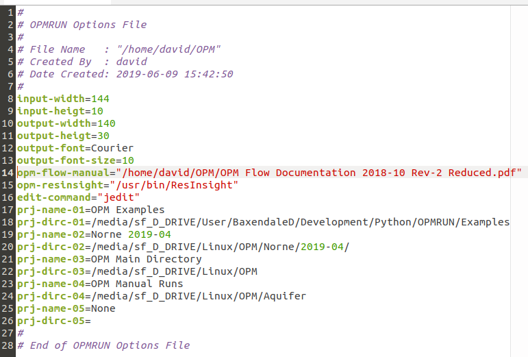

Use the Edit/Options menu to edit options and Edit/Projects menu to edit project names and directories.

