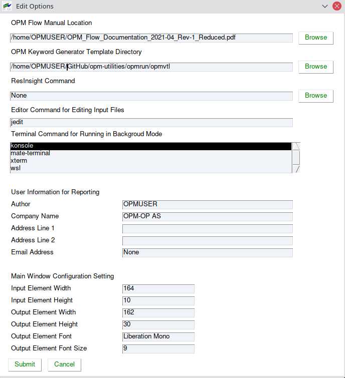
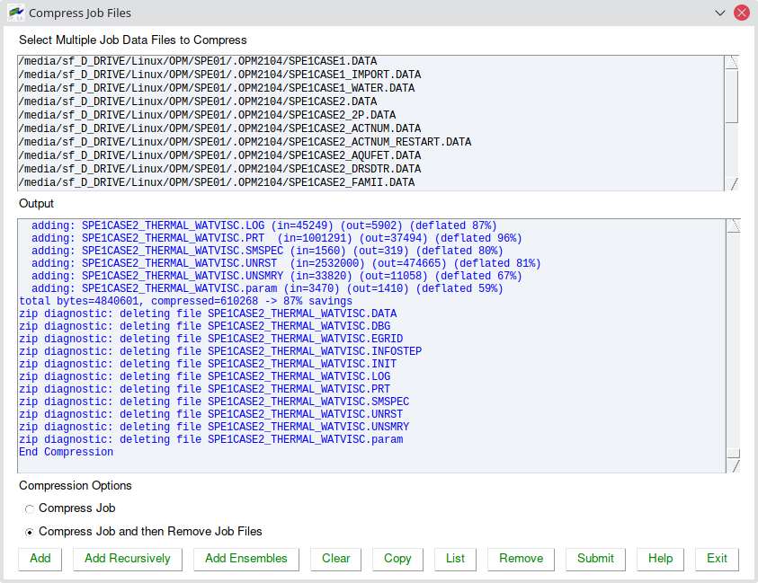
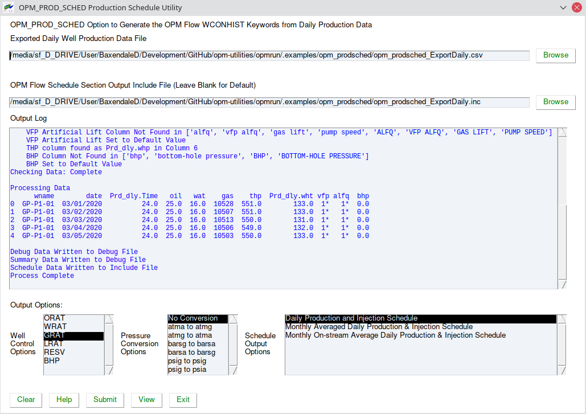
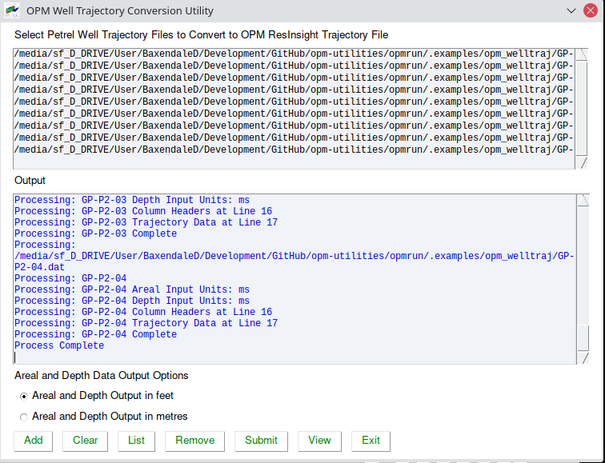

# OPMRUN
OPMRUN is graphical user interface to Flow that has similar functionality to the 
commercial simulator’s ECLRUN program. Target audience are Reservoir Engineers in a 
production environment. Developers and experienced Linux users will already have 
compatible work flows.

  * Allows editing and management of OPM Flow’s run time parameters. Default 
parameters are automatically loaded from OPM Flow, and the user can reset the 
default parameter set either from a parameter or PRT file. Editing of a job’s 
parameter file is also available.

  * Runs under Linux and Windows 10. When running under Windows 10, OPMRUN runs OPM Flow  via the Windows Subsystem 
for Linux (“WSL”).

  * Allows simulation jobs to be queued and run in either foreground (under OPMRUN),
or in background in a xterm terminal session in Linux, or WSL under Windows 10. Jobs 
in the queue can be set to run in NOSIM mode or RUN mode.

  * Foreground jobs can be killed from OPMRUN, with the option of killing all the 
jobs in the queue.

  * Queues can be edited, saved and loaded.

Various additional simulation input generation and conversion utilities are available including:
   * Compressing a job to save space (DATA, and all OPM Flow output files) and 
uncompressing previously compressed jobs. 
   * Keywords, a keyword generator application based on the Apache Velocity Template Language 
(“VTL”). The templates can therefore also be used with any editor that supports 
VTL, jEdit for example. There is one template per keyword, with the formatting the 
same as the OPM Flow manual. Over 450 templates are currently implemented. One can
also customize the existing templates as well as creating User defined templates. 
The keywords are examples, one still has to edit the resulting deck with the actual
required data, but the format with comments should make this a straight forward 
process.
   * A Production Schedule application that takes a comma delimited CSV file 
containing historical production and injection data and converts the data to an 
OPM Flow SCHEDULE file using the WCONHIST series of keywords. Currently, only 
production data is supported.
   * Sensitivities application that generates sensitivity cases based on a "Base" 
case file. The Base file contains "Factors" (variable names), $X01, $X02, etc., 
that are substituted with user defined values using the data entered and the type
of Sensitivity Scenario selected. 
   * A Well Specification application that users the standard well export files 
from OPM ResInsight to reformat the data in a more user-friendly manner for the 
WELSPECS and COMPDAT keywords. Optionally, the application can generate the 
COMPLUMP keyword based on the OPM ResInsight layers file, with one completion 
per defined reservoir layer. 
   * Calling OPM ResInsight and loading the currently selected job into OPM 
ResInsight for viewing. 
   * A Well Trajectory Conversion application that converts a Schlumberger Petrel 
exported well trajectory file into an OPM ResInsight file, containing all the wells.

**Notes:**
1. Only Python 3 is supported and tested, Python2 support has been depreciated. 
2. The following standard module Python libraries are required.
   * datetime, getpass, importlib, os, numpy, pkg_resources, pandas, pathlib, 
platform, psutil, sys, re, subprocess, and tkinter as tk.
3. In addition, the following non-standard Python modules are required:
   * airspeed, notify-py, pyDOE2, and PySimpleGUI.
4. For some Linux systems the relevant package manager may have to be used to
install tkinter as tk; whereas,for Windows 10 users the tkinter package is 
pre-installed with Python.

# OPMRUN Functionality

## Simple and Clean Interface.
The program has upper and lower display elements. The upper element shows a list
of simulation jobs that are in the job queue (**Job List Element**) and the 
lower element (**OPM Flow Output Element**) consists of two elements, one for the 
OPM Flow Output (the terminal output from OPM Flow) and a second element (OPM Run 
Log) that is a session log of the jobs run by OPMRUN. Clicking the **Output** and 
**Log** tabs switches the display on the lowered element between the two display 
types.

## Add Job and Select Run Type
To add jobs to the queue use the **Add Job** button or load an existing job queue 
using the **Load Queue** button. Jobs can be edited or deleted from the queue using 
the **Edit Job** and **Delete Job** buttons, and a series of jobs can be saved as a 
job queue by using the Save Queue button. The Clear Queue button deletes all jobs 
from the queue.

## Edit Job Data and Parameter File.
Jobs in the queue can be edited by selecting the **Edit Job** button that will 
display two options: one to edit the input file using the defined editor and the 
second to edit the OPM Flow Parameter File.

Selecting the **Edit Parameter File** option will display a dialog box that shows a
list of the OPM Flow command line parameters together with the parameter help 
information. 

Selecting a parameter from the list and selecting the **Edit** button will display
the setting for the selected parameter (alternatively one can double click the 
required entry).  One can then edit the parameter as required. Use the **Save** 
button to save the change and use the **Exit** button to save all the changes to 
the parameter file. The **Cancel** button will cancel all changes to the parameter 
file.

## Load Previously Saved Queue.
To load a previously saved job queue, press the **Load Queue** button this will 
display a dialog box allowing the user to select a queue file (*.que), after 
pressing the OK button the jobs will be displayed in the **Job List Element** as 
illustrated below.

## Reset Job Queue Parameters
**Reset Job Queue** Parameters allows jobs to run under Windows 10 WSL to be 
renamed for running under Linux, and changing jobs from serial to parallel and vice
versa.

The application will attempt to list or Linux mount points and Windows drives 
depending on the host operating system, once the two systems mount and drive points
have been selected then the files in the queue will be renamed from the previous 
host system to the current host system. This is only performed for the *.DATA files,
included files in the input deck are currently not converted.

## Run Jobs in Queue with Various Options.
Selecting the **Run Jobs** button displays the Select Run Option dialog, the 
**Run in No Simulation Mode** option is equivalent to setting the NOSIM option in 
the input deck for all jobs in the queue. Selecting **Run in Standard Simulation Mode**
will run all the jobs in the queue sequentially, with the OPM Flow terminal output 
directed to **OPM Flow Output Element**. The terminal output is also directed to 
a *.LOG file as well, similar to what the commercial simulator does.

Running a Job in the Queue Creates a Log File which is a copy of the terminal output.

Notice also how OPMRUN deletes all the existing output files for a given job, if 
they exist, before running OPM Flow, as well as creating a Schedule Log for 
tracking progress

One can also **Kill** the current running job. If a job is killed then there is an 
additional option to kill all jobs in queue.

The **Clear** button clears the OPM Flow Output Element from the currently displayed 
tab (Output or Log) and the **Copy** button copies the data to the clipboard. 

## File Menu Options
Enables open and saving the job queue, switching projects and listing OPMRUN's user 
properties.

## Edit Menu Options
Lets one add jobs, add jobs recursively (all jobs in the selected directory and 
below), edit the data and the parameter file for the selected job, edit, list and 
set the default parameters for running jobs that will be added to the queue, 
set OPMRUN options, and set the project’s project directories.

The options are also available by right-clicking a job in the **Job List Element**.

The Edit Parameters, List Parameters and Set Parameters relate to the default 
parameter set, not the parameter set for a particular job. When a new job is 
added to the queue the application checks if a *.PARAM file exists for the job, if 
not then the default parameter set is used for the job. Editing the default 
parameter set is the same as editing a job parameter set.

OPMRUN has several configuration options that can be set via the Edit/Options menu 
options including setting:
   * The location of the OPM Flow manual.
   * The Keyword Generator Template Directory, one of tools supplied with OPMRUN.
   * The location of the ResInsight program, for loading the results of a 
simulation run for viewing.
   * The editor command to used to edit the input deck and view the resulting 
simulator output files.
   * The terminal console to be used for background jobs. WSL (“Windows Subsystem 
for Linux) should be selected if OPMRUN is running under Windows 10 to enable jobs
to be submitted to the installed Linux distribution. 
   * The User Information series of fields are used by various supplied tools and 
in some templates used by the Keyword Generator application. Note if a User 
Information” field is not defined then the template variable will be output 
instead – this can easily be deleted in the application. 
   * One can also define the main OPMRUN windows configuration parameters define:
input (**Job List Element**) and output panel’s (**OPM Flow Output Element**) size, 
font and font size.
  

In addition to the aforementioned options, the **Edit/Projects** menu item enables 
the setting of project directories that allows the user to set a default directory 
for loading and saving files within OPMRUN and the auxiliary applications.

## View Menu Options.
Allows the user to view the results of an OPM Flow simulation run using the default
editor. The options are also available by right-clicking a job in the **Job List 
Element**

## Tools Menu Options
Contains various tool that may be useful in building a simulation model.

See the individual sections below for further details on the available tools.

## Help Menu Options

Use the **Edit/Options** menu option to select the location of the OPM Flow Manual.

# OPMRUN TOOLS

## OPMRUN Tool: Job File Compression Utility for Saving Space and Archiving.
The **Tools/Compression Jobs** option allows the user to compress a series of jobs 
into individual zip files (one zip file per job), as well as uncompressing 
previously zip job files. 

Note there is a similar application for uncompressing zip files and that the tool 
users the Linux zip and unzip programs both on Linux host systems and Windows 10 
systems using WSL.

## OPMRUN Tools: Simulator Input/Keywords

The **Tool/Simulator Input/Keywords** is a keyword generator and editor for OPM 
Flow input decks (*.DATA files) that can generate specific keywords, as well as complete
sections. The generated data must be edited with the users actual data, but comments and layout
should make that process relatively straight forward.

The application consists of several elements, a conventional menu system at the top,
a **Deck Element Area** that will contain the resulting generated keywords, a 
**Keyword Element Area** for the user to select the keyword, data, models or user 
templates, and finally a series of buttons, **HEADER**, **GLOBAL**, etc., that 
are used to select the keywords in an OPM Flow section, specific data sets, 
models or user defined templates.  The selection will appear in the **Keyword 
Element Area**.

Clicking on an item in the **Keyword Element Area** will generate the data for the
item in the **Deck Element Area**, as shown below for the OPM Flow copyright header:

The **Deck Element Area** is editable by simply clicking anywhere in the element and 
making changes. Use the **Clear** button to clear the **Deck Element Area** display, 
the **Copy** button to copy the **Deck Element Area** data to the clipboard, and the
**Save** button to save the data to a file. The **Load** button allows one to load an
existing file into the **Deck Element Area** for additional editing.

Note that the **HEADER** section is not an OPM Flow section, but a list of various 
comment block headers used to make the deck more readable.

**Keywords: Menu Items**

The various menu options include the File Menu

Where the **Open** and **Save** options load and save a file, and the **Properties**
displays OPMRUN's properties.

The Edit Menu provides some basic standard editing facilities

Next, the Generate Menu options allows one to generate a complete section of 
keywords, as described below. These options are equivalent to selecting the 
section keyword (**RUNSPEC**, **GRID**, etc.) in the **Keyword Element Area**.

Finally, the Help Menu option display the Keyword Help information:

and the Velocity Template Help.

As mentioned previously, the tool users the Apache Velocity Template Language
("VTL") for the templates. VTL is a common templating language used by many 
programming editors, and therefore the templates can also be used directly with an 
editor, provided the editor supports VTL. The keyword templates are comparable to 
the examples depicted in the OPM Flow Manual.

**Keywords: File Imports**

If a keyword requires a file, for example, the INCLUDE and LOAD keywords, then a 
dialog box is presented to enable the file to be selected. The application will 
also allow one to select the file name format, after the file has been selected.

**Keywords: Section Standard Set of Keywords**

Selecting a Generate Menu option or a Section keyword (RUNSPEC, GRID,  EDIT, PROPS,
SOLUTION, SUMMARY, and SCHEDULE) in the **Keyword Element Area** will give an 
option to generate a representative set of keywords for that section. One can 
therefore generate a complete input deck in a matter of minutes, as per the RUNSPEC
example in the following figure.

However, you still have to edit this with your actual data.

**Keywords: SUMMARY Section Variables**

For the SUMMARY section keyword, one can also generate various sets of summary 
variables based on the options being used in the model. Note that not all the 
variables are currently available in OPM Flow, but additional variables are added
at each release.

For SUMMARY variables not recognized by OPM Flow, the simulator will issue a 
warning message and ignore those variables not implemented.

**Keywords: SCHEDULE Section Keywords and Date Schedule**

For The SCHEDULE Section keyword, one can also generate a date schedule from  a 
start year to an end year, using Annual, Quarterly, or Monthly time steps. A 
standard report is written at the beginning of each year and is subsequently switch 
off for the intermediate  Quarterly and Monthly time steps. A final report is written 
at the end of the run.

**Keywords: DATA (Sets) Option**

There is also a **DATA** option which is not an OPM Flow section, but a series of data 
sets. This is a collection of data sets that can be used as complete examples for a
given data set, PVT for a Wet Gas Reservoir for example, or to build models for 
testing.

**Keywords: MODEL Option**

Again, the **MODEL** option is not an OPM Flow section, but contains complete models that show how various options are 
implemented in OPM Flow. 

**Keywords: USER Templates Option**

Finally, the **USER** option is where users can store their own templates. **USER** 
templates with the “vm” extension will automatically be listed by the **USER** 
button. To use this feature, after selecting a keyword, right-clicking on the 
keyword allows one to load the actual template for the keyword. One can then edit 
the template and save the changes back to the same template or another template 
using the **Save** button.

The Template Help option displays a brief introduction to VTL for further reference.

## OPMRUN Tools: Simulator Input/Production Schedule
The **Tools/Simulator Input/Production Schedule** application takes a comma 
delimited CSV file containing historical production and injection data and converts
the data to an OPM Flow SCHEDULE file using the WCONHIST series of keywords. An 
example input file is shown below:

The first row in the input file is a header row that declares the data type for a 
column, the example shows typical Oil Field Manager ("OFM") header variable names, 
but various variable names can be used to define the data type.

The tool can convert daily production data to a: daily production schedule, monthly 
average, or monthly on-stream average production schedule, as shown below:

Notice that the application checks various variable names for the column headers. 
For example for the BHP data, the column names can be: bhp, bottom-hole pressure, 
BHP, or BOTTOM-HOLE PRESSURE. 

A sample of the generated output file is shown below:

**Note the current release only support production data via the WCONHIST keyword, 
injection data via WCONINJH keyword is not supported.**

## OPMRUN Tools: Simulator Input/Sensitivities
The **Tools/Simulator Input/Sensitivities** option generates sensitivity cases 
based on a "Base" case file. The Base file contains "Factors" (variable names), 
$X01, $X02, etc., that are substituted with user defined values using the data 
entered and the type of Sensitivity Scenario selected. Thus, the first step is to
configure the Base file in a text editor by replacing actual values by the variable
names, previously mentioned.  

After editing the Base file, the next step is to load the Base file into the 
application using the **Base** button, which will prompt the user for the file to 
load and then display the file in the **Base** tab, as shown below:

Limited editing of the **Base** file is supported on the above screen.

The next step is to define the "Factors" and the factor values. A total of 20 
factors are available and each factor consist of a Low, Best and High estimates. 
Note it is not necessary to enter all three estimates, if one wishes just to generate 
a limited sensitivity case. For example, if on wishes to only run a Low Scenario 
sensitivity then it is only necessary to enter data for the Low factor values.

Previously saved factor data can be loaded via the **Load** button, as shown below:

Selecting a Factor Description row allows one to define a description for the factor
variable, so for $X01 in the above figure the description is GRID - PERMX. When 
selecting a Factor Description, a popup dialog will be displayed to enter the data, 
and if one right-clicks on the popup's Factor Description field one can select a 
description for one of the pre-defined descriptions as illustrated in the next 
figure.

 
After the Sensitivity Factors have been entered one can then select the Sensitivity
Scenario that one wishes to use to generate the sensitivity cases. In the figure 
below the _Factorial: Low, Best and High Box-Behnken_ DOE (Design of Experiments) 
has been selected. Selecting the **Generate** button, runs a series of checks, and 
if there 
are no errors the program will enquire if you wish to generate the set of cases.

If the Yes option is selected then the cases will be generated and the application 
will ask for the name of the OPMRUN Queue file to write the jobs to, as depicted 
below:

This allows the user to load the queue file into OPMRUN and to run all the jobs.

## OPMRUN Tools: Simulator Input/Well Specification
This tool, **Tools/Simulator Input/Well Specification**, users the standard well
export files from OPM ResInsight to reformat the data in a more user-friendly 
manner for the WELSPECS and COMPDAT keywords. Optionally, the application can 
generate the COMPLUMP keyword based on the OPM ResInsight layers file, with one 
completion per defined reservoir layer. 

**OPM ResInsight Exported Well Completion File Format(.exp)**

**OPM ResInsight Imported Formation Layer File (.Lyr)**

The application also can generate a well a OPM ResInsight perforation file with the
formation names for cross-checking the perforations.

In the above the _Output Header_ options are used for comments only, no unit 
conversion is performed.

In terms of output, the next figure shows the resulting well completion file to be used with 
OPM Flow, showing the WELSPECS and COMPDAT keywords (the COMPLUMP keyword is not shown in this 
example)

and the final figure for this tool shows the resulting generated OPM ResInsight 
perforation file.

## OPMRUN Tools: ResInsight
This option, **Tools/ResInsight**, loads the currently selected job into OPM 
ResInsight for viewing, this done via a Python sub-process call in OPMRUN, rather 
than using OPM ResInsight's Python API.

## OPMRUN Tools: Well Trajectory Conversion
OPM ResInsight can read well trajectories in a given format into the program, the 
**Tools/Well Trajectory Conversion** option coverts a Schlumberger Petrel exported 
well trajectory file, as shown below:

into a OPM ResInsight well trajectory file containing all the wells.

The utility allows for the multiple wells to be converted at once and for conversion
of units. Note in some areas of the world it is not uncommon for the areal 
units to be in UTM and the depth to be in feet. This configuration is also handled 
by the application.

An example output file is shown below

**END OF DOCUMENTATION**

